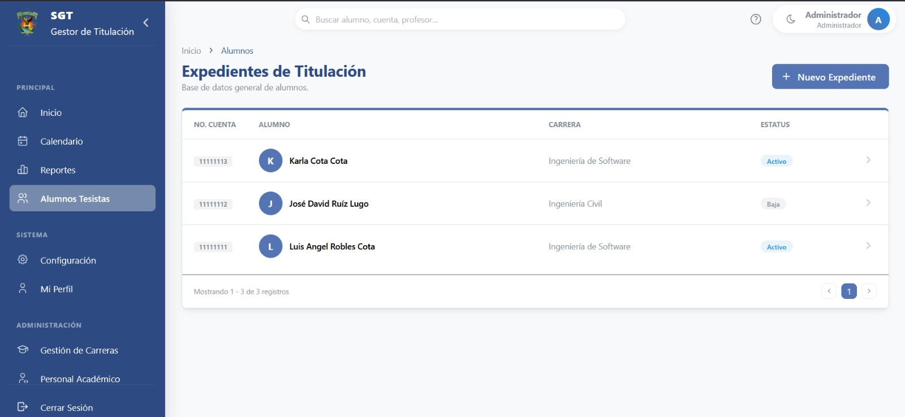
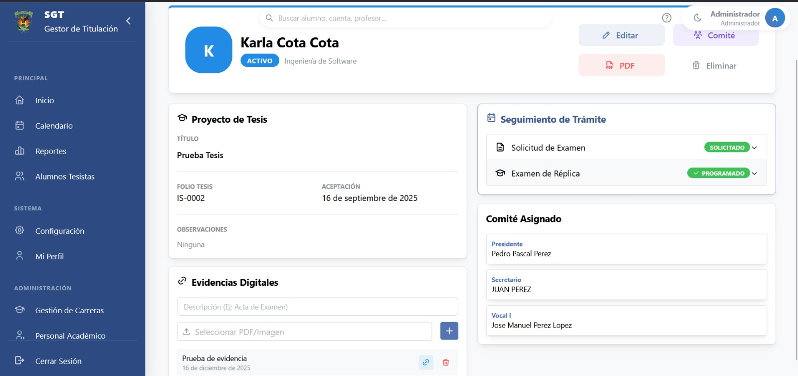
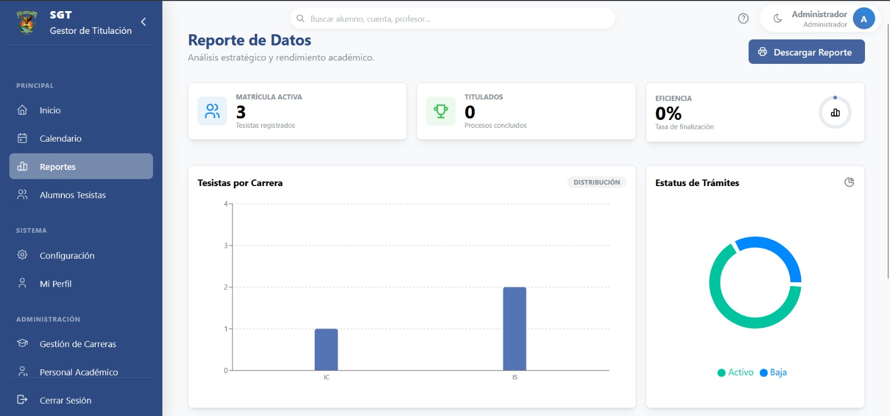

# SGT – Sistema de Gestión de Titulación Académica

Plataforma web para la digitalización y gestión integral del proceso de titulación en instituciones educativas.

---

## Descripción

SGT es un sistema desarrollado para reemplazar procesos manuales basados en hojas de cálculo, proporcionando control, trazabilidad y eficiencia en la gestión de expedientes de titulación.

Permite centralizar la información, automatizar el seguimiento de procesos y generar documentación académica de forma estructurada.

---

## Problema que resuelve

En muchas instituciones, el proceso de titulación se gestiona mediante herramientas manuales como Excel, lo que genera:

- Errores humanos
- Duplicidad de información
- Falta de trazabilidad
- Procesos administrativos lentos

SGT digitaliza y optimiza este flujo, mejorando la eficiencia operativa.

---

## Funcionalidades principales

- Gestión de expedientes de alumnos
- Seguimiento del proceso de titulación
- Gestión de eventos académicos
- Control de estatus
- Gestión de comité académico
- Carga y administración de evidencias digitales
- Generación de reportes y documentos
- Dashboard con métricas del sistema

---

## Roles del sistema

- **Administrador**
  - Gestión completa del sistema
  - Administración de usuarios, carreras y expedientes

- **Usuario básico**
  - Consulta y seguimiento de información

---

## Arquitectura

Sistema basado en arquitectura cliente-servidor con API REST:

- Frontend: React + Mantine
- Backend: Node.js
- Base de datos: PostgreSQL

### Despliegue

- Frontend: Vercel
- Backend: Render
- Base de datos: Supabase

---

## Interfaz del sistema

> IMPORTANTE. Las siguientes imágenes utilizan datos simulados con fines de demostración.  
> El sistema está diseñado para operar con información real en un entorno institucional.

### Gestión de expedientes

### Detalle de expediente

### Reportes y métricas

---

## Estado del proyecto

- Versión 1 funcional
- Despliegue de demostración
- Preparado para uso institucional
- Diseñado para escalabilidad y mantenimiento futuro

---

## Impacto

- Sustitución de procesos manuales
- Reducción de errores administrativos
- Mejora en tiempos de gestión
- Trazabilidad completa del proceso de titulación

---

## Roadmap

- Control de permisos basado en roles (RBAC)
- Sistema de notificaciones
- Auditoría de cambios
- Firma digital de documentos
- Dashboard analítico avanzado
- Integración con sistemas académicos existentes

---

## Documentación técnica

- [Arquitectura del sistema](./docs/architecture.md)
- [Flujo del proceso de titulación](./docs/workflow.md)

---

## Nota

Este proyecto representa una implementación funcional orientada a uso institucional, diseñada para ser mantenida y evolucionada por futuros equipos de desarrollo.

